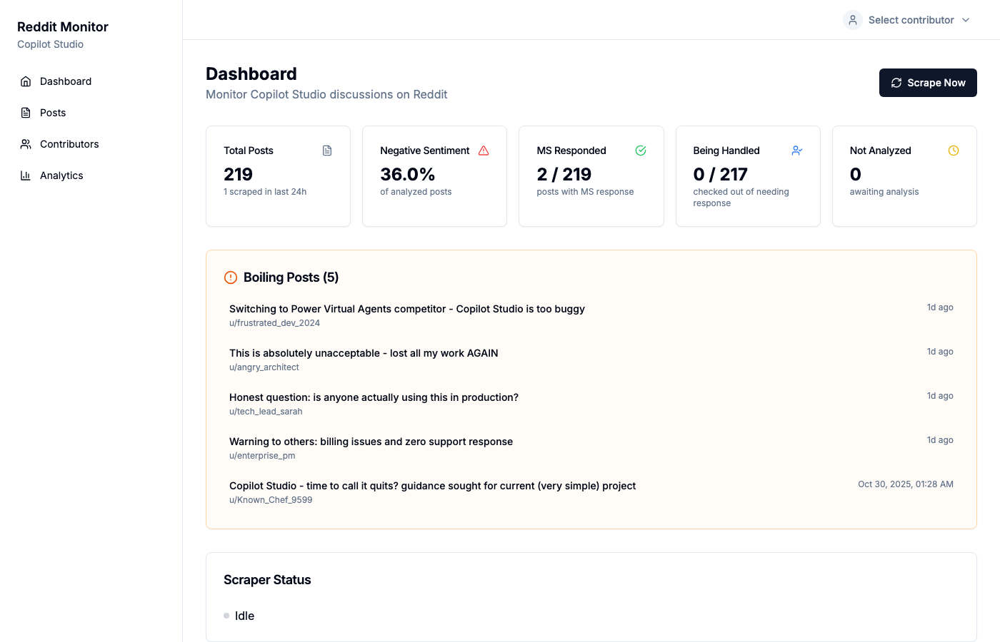
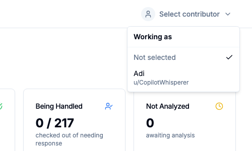
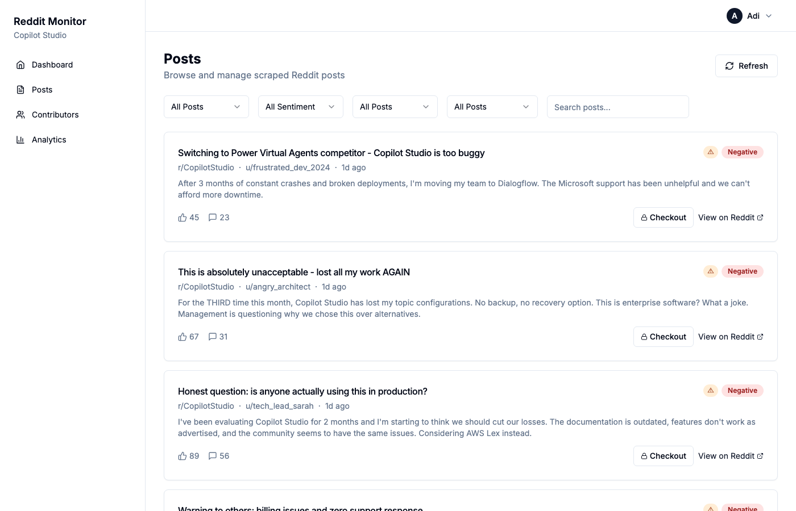
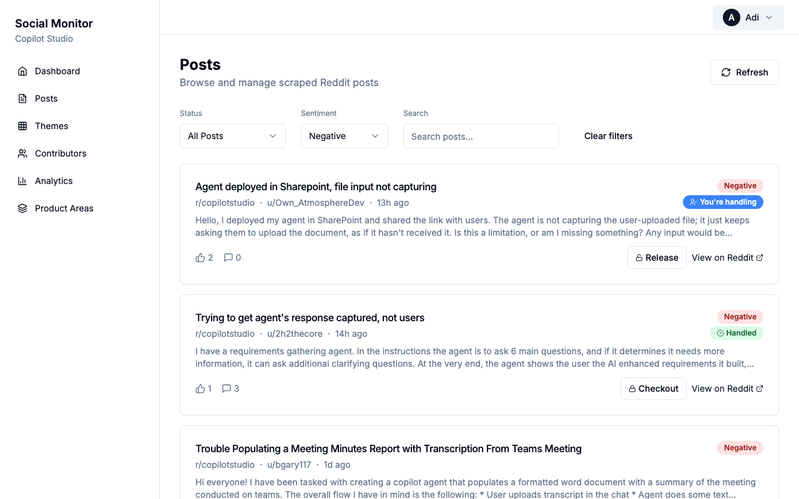
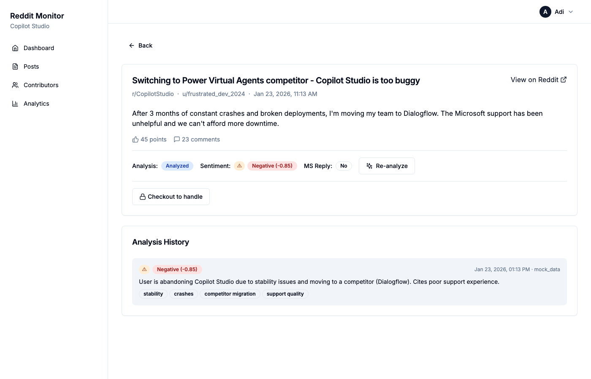
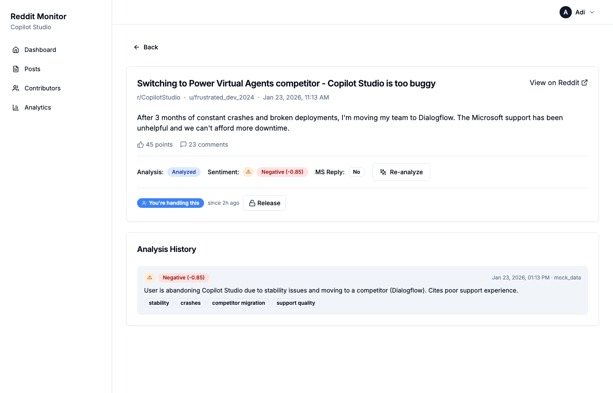
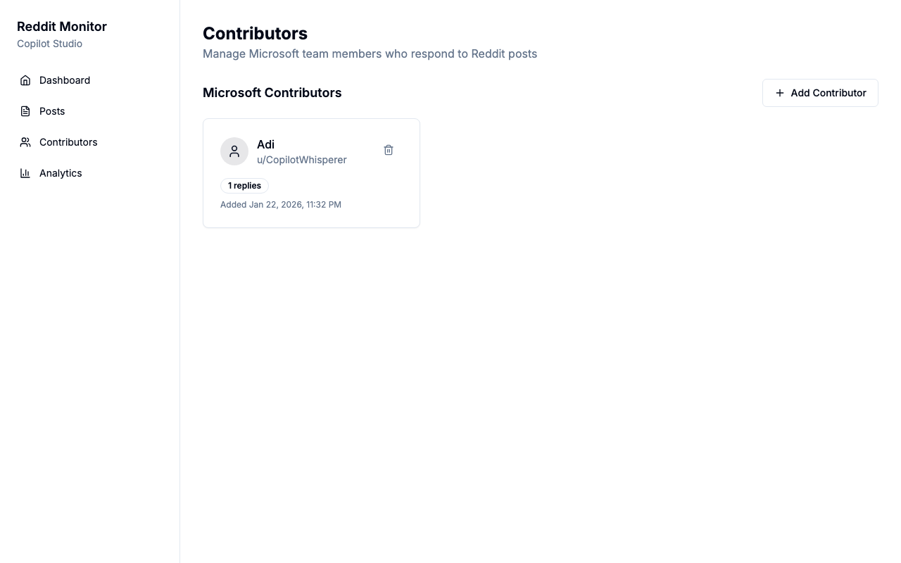
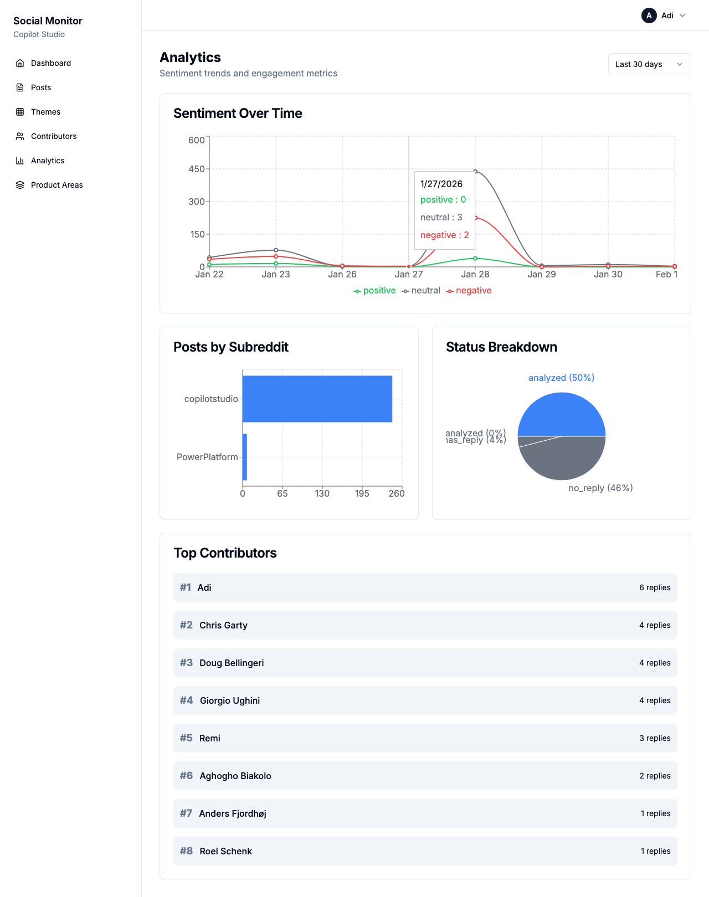
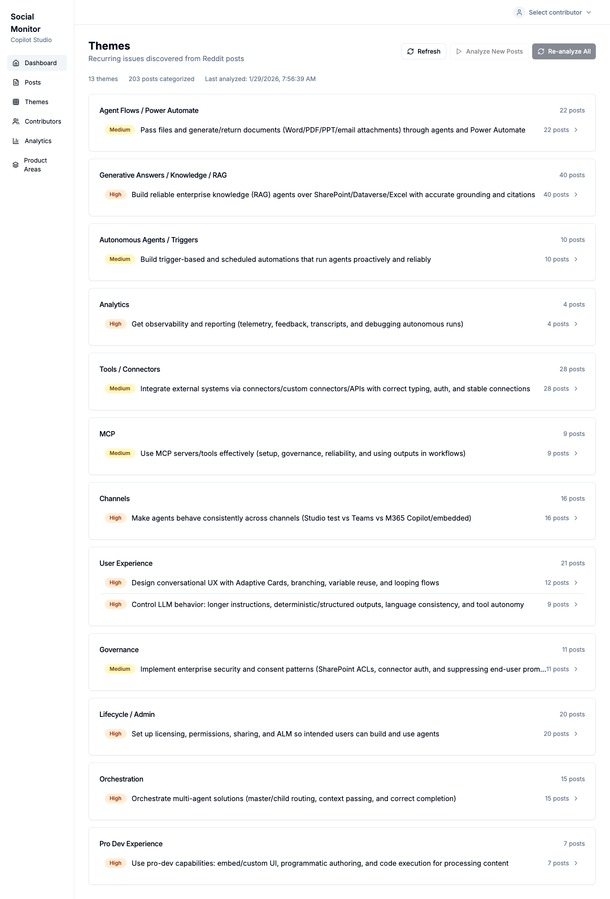

# Copilot Studio Reddit Monitor

**Version 2.0.0**

A full-stack application to monitor Reddit discussions about Microsoft Copilot Studio, analyze sentiment using LLMs, and track Microsoft contributor engagement.



## Features

### Dashboard Overview
Real-time monitoring of Reddit activity with key metrics:
- **Total Posts** - All scraped posts from r/CopilotStudio
- **Negative Sentiment** - Percentage of posts with negative sentiment
- **MS Responded** - Posts that have received a Microsoft contributor response
- **Being Handled** - Posts checked out by contributors (awaiting response)
- **Not Analyzed** - Posts awaiting LLM analysis
- **Boiling Posts** - Warning posts needing immediate attention

### Contributor Checkout System
Contributors can claim posts they're working on to prevent duplicate effort:



- Select your identity from the header dropdown (persists in localStorage)
- **Checkout** posts you're responding to
- See which posts are being handled by teammates
- **Release** posts when done or passing to someone else

### Posts Management
Browse, filter, and manage all scraped Reddit posts:



- Filter by **analysis status** (Analyzed / Not Analyzed)
- Filter by **sentiment** (Positive, Neutral, Negative)
- Filter by **MS Reply** (Has Reply / No Reply)
- Filter by **checkout status** (My Checkouts / Available)
- **Search** posts by title or content
- Posts with **warning flags** automatically appear at the top
- View sentiment badges, checkout status, Reddit score, and comment count

### Warning Detection
The LLM analyzer automatically detects escalation-worthy posts that need immediate attention:



Warning triggers include:
- Users expressing intent to quit or switch to competitors
- Loss of faith/confidence in the product ("I've lost faith", "time to call it quits")
- Hostile or derogatory language toward the product
- Deadline pressure combined with reliability concerns
- Users citing other frustrated community members as validation

Warning posts display a **⚠ badge** and are always sorted to the top of the list.

### Post Detail View
Deep dive into individual posts with full analysis:



- Complete post text from Reddit
- Sentiment analysis with confidence score
- Key issues identified by LLM
- **Checkout/Release** buttons to claim posts
- Microsoft contributor response tracking
- Re-analyze button for fresh LLM analysis
- Direct link to original Reddit post



### Contributors Management
Track Microsoft employees who respond to Reddit posts:



- Add/remove contributors by Reddit handle
- Automatic detection when contributors reply to posts
- Posts auto-marked as "Handled" when a contributor responds
- Reply count tracking per contributor
- **Activity analytics** - Click a contributor name to view reply trends, response time distribution, and handled posts breakdown

### Analytics Dashboard
Visualize sentiment trends and engagement metrics:



- **Sentiment Trends** - Line chart showing positive/neutral/negative over time (7-90 days)
- **Subreddit Breakdown** - Post distribution by source
- **Status Distribution** - Pending/Analyzed/Handled breakdown
- **Contributor Leaderboard** - Most active responders

### Pain Point Clustering
Discover recurring themes and pain points across posts using LLM analysis:



- **Automatic theme discovery** - LLM analyzes posts in batches to identify common issues
- **Product area categorization** - Themes grouped by product area (Authentication, Connectors, etc.)
- **Severity ratings** - Each theme rated 1-5 for prioritization
- **Heatmap visualization** - See theme frequency and severity at a glance
- **Incremental analysis** - New posts automatically assigned to existing themes

### Post Resolution
Mark posts as "done" when they no longer need attention:

- **Resolve posts** - Click "Mark as Done" when a post has been addressed or vetted
- **Reopen posts** - Resolved posts can be reopened if follow-up is needed
- **Status filter** - Filter posts by Open, Resolved, or show all
- **Separate from MS Response** - Resolution is independent of whether MS has replied

### Reader Access (v2.0.0)
Add view-only users who can monitor without performing actions:

- **Reader user type** - Users with Microsoft alias but no Reddit handle
- **Full read access** - Can view all pages, posts, analytics, and themes
- **No write access** - Cannot checkout, resolve, analyze, or manage users
- **Easy conversion** - Add a Reddit handle to convert reader to contributor

## Tech Stack

### Backend
- **FastAPI** - Python web framework
- **SQLAlchemy** - ORM with SQLite (local) / Azure SQL (production)
- **LLM Support** - Ollama (local) or Azure OpenAI (production)
- **APScheduler** - Background job scheduling

### Frontend
- **Next.js 14** - React framework with App Router
- **TypeScript** - Type-safe JavaScript
- **Tailwind CSS** - Utility-first styling
- **shadcn/ui** - React component library
- **Recharts** - Data visualization

### Testing
- **Playwright** - End-to-end testing with screenshot capture on failure

## Quick Start

### Prerequisites
- Python 3.11+
- Node.js 18+
- **LLM Provider** (one of the following):
  - Ollama with llama3.2 model (for local development)
  - Azure OpenAI (for production) - any chat completion model

### Backend Setup

```bash
cd backend

# Create virtual environment
python3 -m venv venv
source venv/bin/activate

# Install dependencies
pip install -r requirements.txt

# Configure environment
cp .env.example .env
# Edit .env with your settings

# Run the server
uvicorn app.main:app --reload
```

### Frontend Setup

```bash
cd frontend

# Install dependencies
npm install

# Run development server
npm run dev
```

### LLM Setup

**Option 1: Ollama (Local Development)**
```bash
# Pull the model
ollama pull llama3.2

# Ollama runs automatically on localhost:11434
```

**Option 2: Azure OpenAI (Production)**
```env
# Set in backend/.env
LLM_PROVIDER=azure
AZURE_OPENAI_ENDPOINT=https://your-resource.openai.azure.com
AZURE_OPENAI_KEY=your-api-key
AZURE_OPENAI_DEPLOYMENT=your-deployment-name  # e.g., gpt-4o, gpt-4o-mini, gpt-4
```

### Access the App
- **Frontend**: http://localhost:3000
- **Backend API**: http://localhost:8000
- **API Docs**: http://localhost:8000/docs

## Project Structure

```
copilot-studio-reddit-monitor/
├── backend/
│   ├── app/
│   │   ├── main.py              # FastAPI app entry
│   │   ├── config.py            # Settings & env vars
│   │   ├── database.py          # SQLAlchemy setup
│   │   ├── models/              # Database models
│   │   ├── routers/             # API endpoints
│   │   ├── schemas/             # Pydantic models
│   │   └── services/
│   │       ├── reddit_scraper.py  # Reddit scraping logic
│   │       └── llm_analyzer.py    # Sentiment analysis
│   ├── migrations/              # Database migrations
│   └── requirements.txt
├── frontend/
│   ├── src/
│   │   ├── app/                 # Next.js pages
│   │   ├── components/          # React components
│   │   └── lib/                 # API client & utils
│   ├── e2e/                     # Playwright tests
│   └── package.json
└── docs/
    └── screenshots/             # App screenshots
```

## API Endpoints

### Posts
| Method | Endpoint | Description |
|--------|----------|-------------|
| `GET` | `/api/posts` | List posts (with filtering) |
| `GET` | `/api/posts/{id}` | Get post details |
| `POST` | `/api/posts/{id}/analyze` | Trigger LLM analysis |
| `POST` | `/api/posts/{id}/checkout` | Checkout post for contributor |
| `POST` | `/api/posts/{id}/release` | Release checkout on post |

#### Post Filters
| Parameter | Values | Description |
|-----------|--------|-------------|
| `analyzed` | `true`/`false` | Filter by analysis status |
| `sentiment` | `positive`/`neutral`/`negative` | Filter by sentiment |
| `has_reply` | `true`/`false` | Filter by MS response |
| `checked_out_by` | contributor ID | Filter by checkout |
| `available_only` | `true` | Only unchecked posts |

### Scraper
| Method | Endpoint | Description |
|--------|----------|-------------|
| `POST` | `/api/scrape` | Trigger manual scrape |
| `GET` | `/api/scrape/status` | Get scraper status |

### Contributors
| Method | Endpoint | Description |
|--------|----------|-------------|
| `GET` | `/api/contributors` | List contributors |
| `POST` | `/api/contributors` | Add contributor |
| `DELETE` | `/api/contributors/{id}` | Remove contributor |

### Analytics
| Method | Endpoint | Description |
|--------|----------|-------------|
| `GET` | `/api/analytics/overview` | Dashboard stats |
| `GET` | `/api/analytics/sentiment` | Sentiment trends |
| `GET` | `/api/analytics/subreddits` | Subreddit breakdown |
| `GET` | `/api/analytics/status-breakdown` | Status counts |

## Testing

### Run E2E Tests

```bash
cd frontend

# Run all tests
npx playwright test

# Run with UI
npx playwright test --ui

# Run specific test file
npx playwright test e2e/posts.spec.ts
```

Screenshots are automatically captured on test failures.

### Take Documentation Screenshots

```bash
cd frontend
npx tsx scripts/take-screenshots.ts
```

## Configuration

### Environment Variables

| Variable | Description | Default |
|----------|-------------|---------|
| `REDDIT_USER_AGENT` | User agent for Reddit API | `CopilotStudioMonitor/1.0` |
| `LLM_PROVIDER` | LLM provider (`ollama` or `azure`) | `ollama` |
| `OLLAMA_BASE_URL` | Ollama server URL | `http://localhost:11434` |
| `OLLAMA_MODEL` | Ollama model name | `llama3.2` |
| `DATABASE_URL` | Database connection string | `sqlite:///./data/reddit_monitor.db` |
| `AZURE_OPENAI_ENDPOINT` | Azure OpenAI endpoint | - |
| `AZURE_OPENAI_KEY` | Azure OpenAI API key | - |
| `AZURE_OPENAI_DEPLOYMENT` | Azure OpenAI deployment name | - |

## Azure Deployment

For production deployment to Azure:

- **Backend**: Azure App Service (Python) or Azure Container Apps
- **Frontend**: Azure Static Web Apps
- **Database**: Azure SQL Database
- **LLM**: Azure OpenAI Service
- **Scheduler**: Azure Functions with Timer trigger

## Usage Workflow

1. **Scrape Reddit** - Click "Scrape Now" on dashboard or wait for auto-scrape
2. **Review Posts** - Browse posts list, use filters to find relevant discussions
3. **Check Warnings** - Warning posts appear at top, indicating users who need attention
4. **Analyze Posts** - Click "Analyze" to run LLM sentiment analysis
5. **Track Contributors** - Add Microsoft team members' Reddit handles
6. **Monitor Trends** - Use Analytics to track sentiment over time

---

## Version History

### v2.0.0 (2026-02-01)

#### What's New

- **Reader user type** - Add view-only users who can see all content (posts, analytics, themes) but cannot perform write actions like checkout, resolve, or run analysis. Readers have a Microsoft alias but no Reddit handle.

- **Post resolution workflow** - Mark posts as "done" or "vetted" when they no longer need attention. Resolved posts can be filtered and reopened if needed.

- **Unified status filter** - New combined filter for post workflow status: All, Open, Mine (checked out by me), Resolved

- **Contributor activity analytics** - View individual contributor activity with reply trends, response time distribution, and handled posts breakdown. Access from the Contributors page by clicking on a contributor name.

- **Pain point clustering** - LLM analyzes posts to discover recurring themes and pain points. Themes are grouped by product area with severity ratings. View the heatmap on the Clustering page.

- **Azure AD authentication** - Secure the application with Microsoft Entra ID (Azure AD). Users sign in with their Microsoft account and are automatically linked to their contributor profile via Microsoft alias.

- **Dashboard improvements** - Empty states for boiling posts section, better data freshness indicators

#### Screenshots

**Contributor Activity Analytics**


**Pain Point Clustering Heatmap**


---

### v1.1.0 (2026-01-24)

#### What's New
- **Contributor checkout system** - Claim posts you're working on to prevent duplicate effort
- **Header contributor selector** - Select your identity from top-right dropdown (persists in localStorage)
- **"Being Handled" dashboard tile** - Shows X/Y posts checked out vs needing response
- **Updated filters** - Filter by analyzed, has_reply, checkout status

#### Breaking Changes
- Removed `status` field from posts (replaced with orthogonal dimensions: `is_analyzed`, `checked_out_by`, `has_contributor_reply`)
- API filter params changed: `status` → `analyzed`, `has_reply`

#### Upgrade Instructions

**If upgrading from v1.0.0**, run these database migrations:

```bash
cd backend
source venv/bin/activate  # or: venv\Scripts\activate on Windows

# Run migrations in order
python migrations/add_checkout_fields.py
python migrations/drop_status_column.py
```

⚠️ **Important**: Run migrations before starting the application. The app will fail if the schema doesn't match.

---

### v1.0.0 (2026-01-23)

#### Initial Release
- Reddit scraping from r/CopilotStudio
- LLM sentiment analysis (Ollama/Azure OpenAI)
- Warning detection for escalation-worthy posts
- Contributor tracking
- Analytics dashboard

#### Upgrade Instructions
Fresh install - no migrations needed. Database tables are created automatically on first run.

---

## License

MIT
