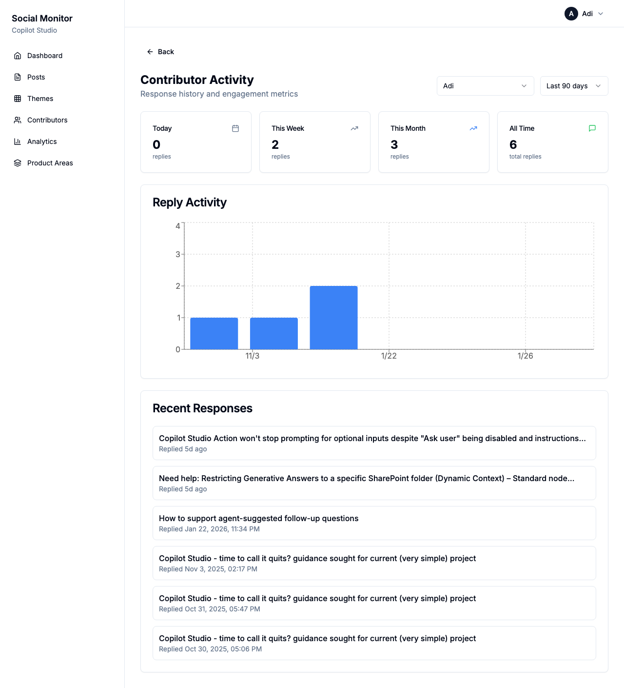

# Copilot Studio Reddit Monitor

**Version 2.0.0**

Monitor Reddit discussions about Microsoft Copilot Studio, analyze sentiment with LLMs, and track team engagement.


## Features

### Dashboard
Real-time overview of Reddit activity:
- **Total Posts** - All scraped posts from r/CopilotStudio
- **Waiting for Pickup** - Posts needing attention
- **In Progress** - Posts checked out by contributors
- **Handled** - Posts responded to or resolved
- **Negative Sentiment** - Percentage requiring attention

### Posts Management


- Filter by **status** (Open, Mine, Resolved), **sentiment**, and **search**
- Sentiment badges show analysis results
- Checkout posts to prevent duplicate effort
- Mark posts as resolved when done

### Pain Point Clustering


- LLM discovers recurring themes across posts
- Themes grouped by product area (Authentication, Connectors, etc.)
- Severity ratings for prioritization
- Incremental analysis assigns new posts to existing themes

### Analytics


- Sentiment trends over time
- Posts by subreddit breakdown
- Status distribution
- Top contributors leaderboard

### Contributor Activity



- Individual reply activity charts
- Response history and trends
- Click any contributor name to view their stats

### Contributors & Readers


- **Contributors** - Team members with Reddit handles who can respond to posts
- **Readers** - View-only users who can monitor but not take actions
- Automatic detection when contributors reply on Reddit

---

## Quick Start

### Prerequisites
- Python 3.11+
- Node.js 18+
- Ollama with llama3.2 (local) or Azure OpenAI (production)

### Setup

```bash
# Backend
cd backend
python3 -m venv venv && source venv/bin/activate
pip install -r requirements.txt
cp .env.example .env
uvicorn app.main:app --reload

# Frontend (new terminal)
cd frontend
npm install && npm run dev

# Ollama (if using local LLM)
ollama pull llama3.2
```

### Access
- **Frontend**: http://localhost:3000
- **API Docs**: http://localhost:8000/docs

---

## Tech Stack

| Layer | Technology |
|-------|------------|
| Backend | FastAPI, SQLAlchemy, SQLite |
| Frontend | Next.js 14, TypeScript, Tailwind, shadcn/ui |
| LLM | Ollama (local) or Azure OpenAI |
| Testing | Playwright E2E |

---

## Configuration

| Variable | Description | Default |
|----------|-------------|---------|
| `LLM_PROVIDER` | `ollama` or `azure` | `ollama` |
| `OLLAMA_MODEL` | Ollama model name | `llama3.2` |
| `AZURE_OPENAI_ENDPOINT` | Azure OpenAI endpoint | - |
| `AZURE_OPENAI_DEPLOYMENT` | Deployment name | - |
| `DATABASE_URL` | Database connection | `sqlite:///./data/reddit_monitor.db` |

---

## Version History

### v2.0.0 (2026-02-01)
- **Readers** - View-only users who can monitor without taking actions
- **Post resolution** - Mark posts as done/vetted
- **Pain point clustering** - LLM discovers recurring themes
- **Contributor analytics** - Individual activity charts
- **Azure AD authentication** - Secure with Microsoft Entra ID
- **Unified status filter** - All, Open, Mine, Resolved

### v1.1.0 (2026-01-24)
- **Checkout system** - Claim posts to prevent duplicate effort
- **Header selector** - Select identity from dropdown
- **Dashboard tiles** - Show workflow status

### v1.0.0 (2026-01-23)
- Initial release with Reddit scraping, sentiment analysis, and contributor tracking

---

## License

MIT
