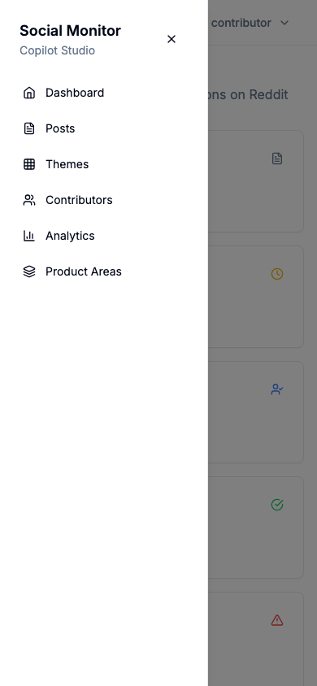
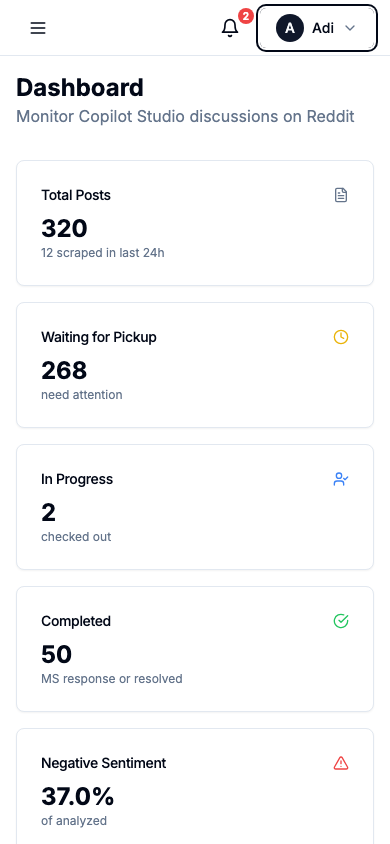
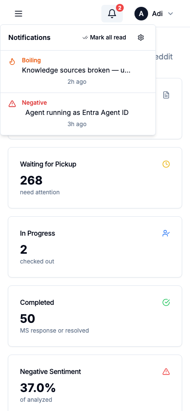
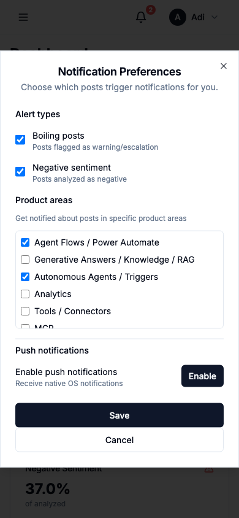

# CS Monitor — Mobile App Guide

The Copilot Studio Social Monitor can be installed as an app on your phone or desktop. You'll get a home screen icon, full-screen experience, and optional push notifications for important posts.

---

## Installing the App

### Android (Chrome)

1. Open the app URL in **Chrome**
2. Chrome shows an **"Install app"** banner at the bottom — tap **Install**
3. If no banner appears: tap the **three-dot menu** (top right) → **Add to Home Screen**
4. The app icon appears on your home screen

### iOS (Safari)

1. Open the app URL in **Safari** (required — Chrome on iOS doesn't support PWA install)
2. Tap the **Share** button (square with arrow at the bottom)
3. Scroll down and tap **Add to Home Screen**
4. Tap **Add** in the top right
5. Open the app from the home screen icon

> **Note**: Push notifications on iOS require **iOS 16.4+** and the app must be opened from the home screen icon (not from Safari).

### Desktop (Chrome / Edge)

1. Open the app URL in your browser
2. Look for the **install icon** in the address bar (a monitor with a down arrow)
3. Click **Install**

---

## Using the App on Mobile

### Navigation

On mobile, the sidebar is replaced by a **slide-out drawer**. Tap the **hamburger menu** (three lines) in the top-left corner to navigate between pages.

### Dashboard

The dashboard shows key metrics — total posts, posts waiting for pickup, in-progress, and completed. All cards are tappable to filter the posts list.

---

## Notifications

### Viewing Notifications

Tap the **bell icon** in the header to see your recent notifications. A red badge shows the number of unread notifications.

Each notification shows:
- **Type** — Boiling (orange flame), Negative (red triangle), or Product Area (blue layers)
- **Post title** — tap to go directly to the post
- **Time** — when the notification was created

Tap the **X** on any notification to dismiss it, or tap **Mark all read** to clear them all.

### Notification Preferences

Tap the **gear icon** (top-right of the notification popover) to open preferences. You can configure:

- **Boiling posts** — get notified about posts flagged as warning/escalation
- **Negative sentiment** — get notified about posts analyzed as negative
- **Product areas** — select specific areas you care about (e.g., "Agent Flows", "Analytics")
- **Push notifications** — enable native OS notifications (see below)

---

## Push Notifications

Push notifications are native OS notifications that appear even when the app is closed — on your phone's lock screen, in the notification center, or as a banner on desktop.

### Enabling Push

1. Open the app and tap the **bell icon**
2. Tap the **gear icon** to open preferences
3. Tap **Enable** under "Push notifications"
4. Your browser will ask for permission — tap **Allow**
5. Tap **Save**

You'll now receive push notifications whenever a post matches your preferences (boiling, negative, or in your selected product areas).

### What Push Notifications Look Like

When a matching post is detected, you'll receive a notification like:

> **Boiling Post**
> User threatening to leave Copilot Studio

Tapping the notification opens the app directly to that post's detail page.

### Disabling Push

1. Open notification preferences (bell → gear)
2. Tap **Disable** under "Push notifications"
3. Tap **Save**

---

## Tips

- **Offline access**: The app caches pages for basic offline viewing. API data requires a connection.
- **Badge count**: The bell icon badge updates every 2 minutes. Push notifications update it instantly.
- **Multiple devices**: Push subscriptions are per-device. Enable push on each device you want notifications on.
- **Token expiry**: If you're signed in via Microsoft, the notification polling continues working even if your session token expires. Push notifications are unaffected by token expiry.
